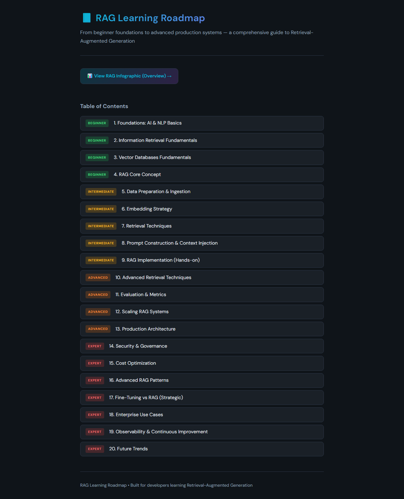
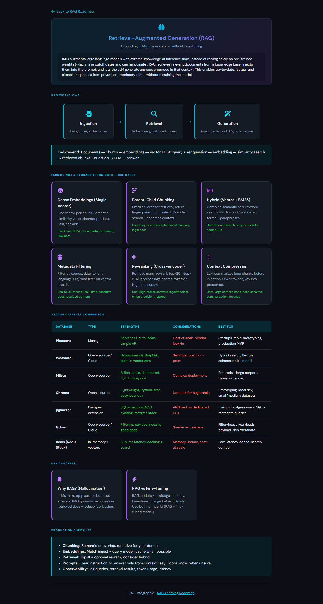
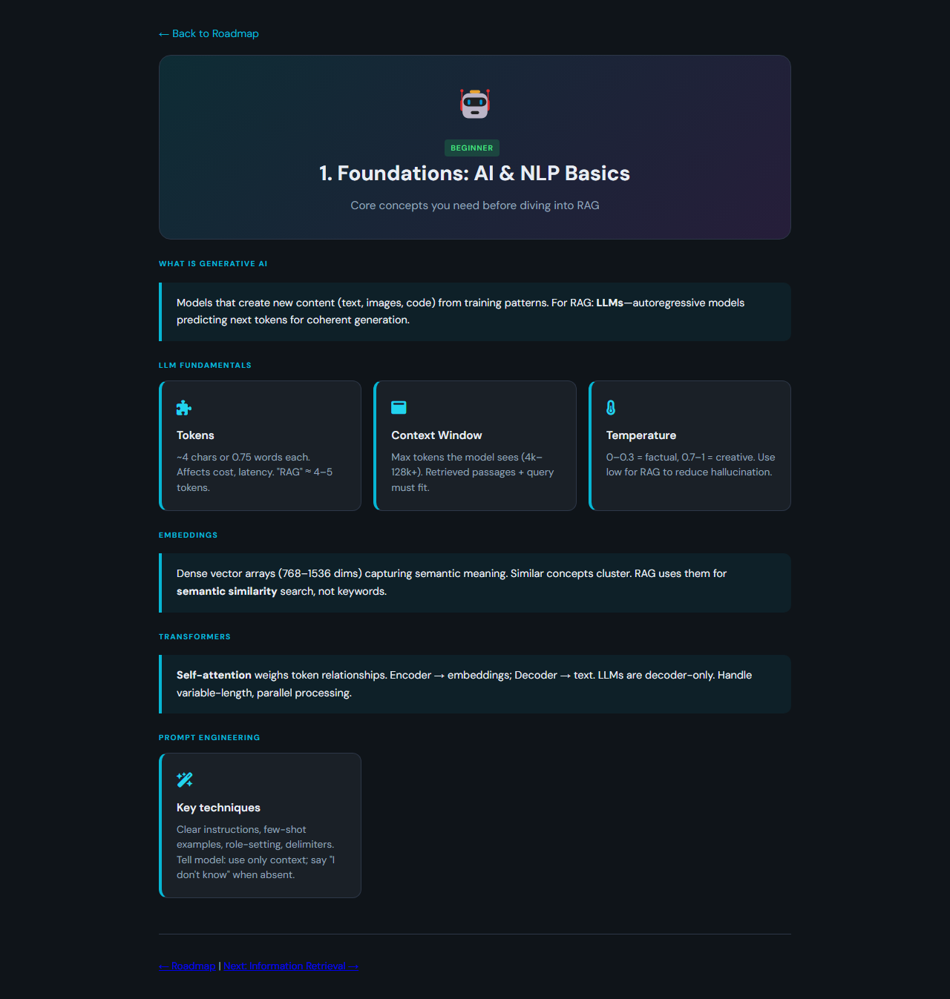
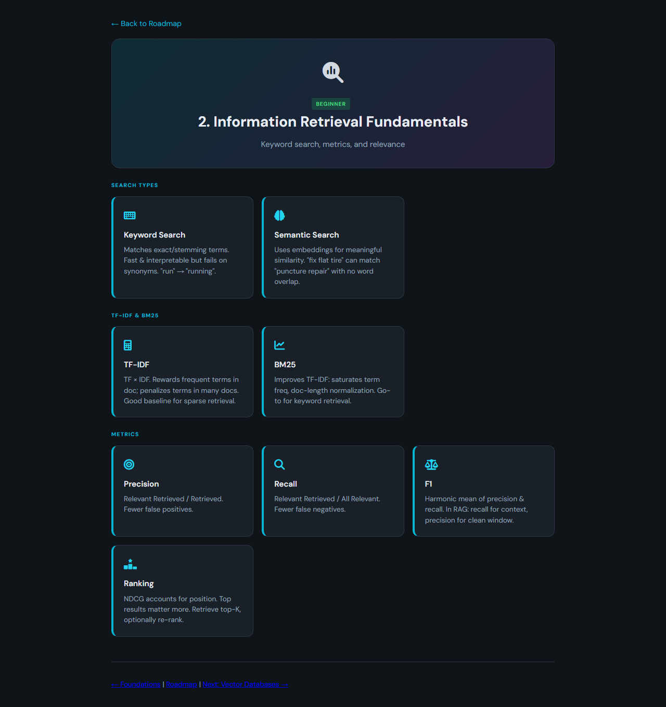

# RAG Learning Roadmap Blog

A static, multi-page blog that walks through a **RAG (Retrieval-Augmented Generation) learning roadmap** from foundations to production. Each of the 20 sections expands the roadmap with explanations for the main ideas and sub-topics. Open `index.html` in a browser or serve the folder locally to read in order or jump to any chapter.

## Structure

- **index.html** — Table of contents and links to all 20 sections; optional **rag-infographic.html** for a visual overview
- **pages/** — One HTML page per roadmap section
- **css/styles.css** — Shared styling (dark theme)

## Screenshots

Previews of the roadmap home, the one-page infographic, and the first two chapter pages (captured at 1280px width; infographic is full-page height).

### `index.html` — table of contents



### `rag-infographic.html` — visual overview



### `pages/01-foundations.html` — chapter 1



### `pages/02-information-retrieval.html` — chapter 2



## Running locally

```bash
npx serve .
# or
python -m http.server 8000
```

Then open the URL shown in the terminal (often `http://localhost:3000` or `http://localhost:8000`).

---

## RAG topics (high level)

The material is grouped into four bands: **Beginner** (1–4), **Intermediate** (5–9), **Advanced** (10–13), and **Expert** (14–20). Below is what each section is *about* at a conceptual level.

### Beginner (1–4)

**1. Foundations: AI & NLP basics** — Core language-model ideas you need before RAG: tokens, context windows, transformers at a high level, and how “generation” differs from pure retrieval. Sets vocabulary for the rest of the roadmap.

**2. Information retrieval fundamentals** — Classical IR ideas that still matter for RAG: documents vs passages, lexical search, ranking, precision/recall intuition, and how “find relevant text” connects to later vector search.

**3. Vector databases fundamentals** — Embeddings as vectors, similarity (e.g. cosine), indexing for nearest-neighbor search, and what vector DBs optimize for (latency, scale, filters) in a RAG stack.

**4. RAG core concept** — The defining pattern: retrieve evidence from a corpus, inject it into the prompt, then generate an answer. When RAG helps vs when a model alone is enough, and the main moving parts (retriever + generator).

### Intermediate (5–9)

**5. Data preparation & ingestion** — Chunking strategies, cleaning and structuring source data, metadata, update pipelines, and how ingestion quality limits retrieval quality.

**6. Embedding strategy** — Choosing or comparing embedding models, domain fit, dimensionality tradeoffs, and how embeddings affect recall and downstream answers.

**7. Retrieval techniques** — Dense vs sparse vs hybrid retrieval, re-ranking, query expansion, and tuning what gets pulled before the LLM sees it.

**8. Prompt construction & context injection** — How to pack retrieved chunks into prompts safely and clearly: system vs user messages, citations, handling conflicts, and staying within context limits.

**9. RAG implementation (hands-on)** — End-to-end wiring: typical libraries/patterns, minimal pipelines, and practical failure modes when moving from slides to code.

### Advanced (10–13)

**10. Advanced retrieval techniques** — Deeper patterns: multi-hop retrieval, graph-augmented ideas, temporal or structured retrieval, and methods that go beyond single-vector lookup.

**11. Evaluation & metrics** — How to measure RAG quality: relevance of retrieved passages, faithfulness to sources, answer correctness, and offline vs online evaluation loops.

**12. Scaling RAG systems** — Throughput, batching, caching, sharding, and operating retrieval + LLM tiers under load without blowing latency or cost budgets.

**13. Production architecture** — Reference-style layouts: ingestion vs serving paths, API boundaries, async jobs, versioning of indexes and models, and resilience patterns.

### Expert (14–20)

**14. Security & governance** — Prompt injection via retrieved content, data leakage, access control on corpora, auditability, and safe handling of untrusted documents.

**15. Cost optimization** — Model choice, caching answers and embeddings, smaller models for retrieval vs generation, and tradeoffs that reduce $ per query.

**16. Advanced RAG patterns** — Agentic RAG, self-correction, iterative retrieval, routing, and architectures that combine multiple tools or retrievers.

**17. Fine-tuning vs RAG (strategic)** — When to invest in supervised fine-tuning vs improving retrieval vs both; data requirements and maintenance tradeoffs.

**18. Enterprise use cases** — Patterns for internal knowledge bases, regulated domains, multi-tenant setups, and aligning RAG with org processes.

**19. Observability & continuous improvement** — Logging queries and retrievals, feedback loops, drift, and using production signals to fix data and prompts systematically.

**20. Future trends** — Emerging directions: longer context, multimodal RAG, tighter hardware/software co-design, and how the field may evolve.

---

Together, these topics define a **full-stack view of RAG**: data and embeddings, retrieval and prompting, evaluation and scale, then security, cost, and operations at an expert level.
